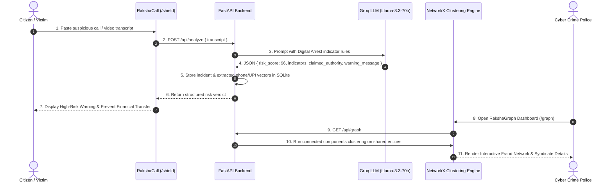
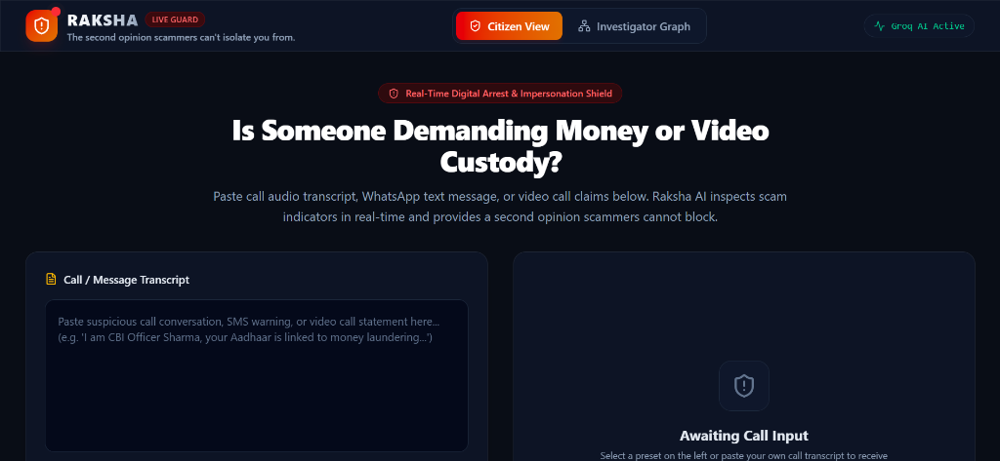
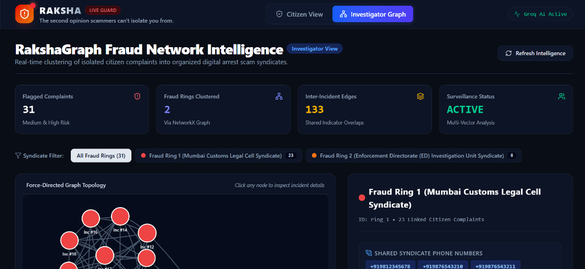
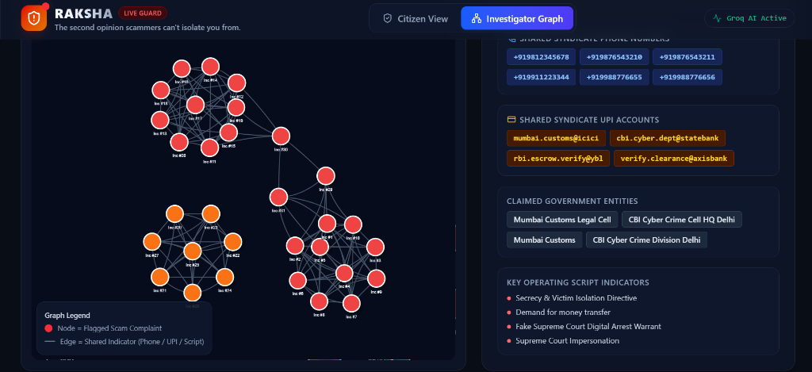

# 🛡️ RAKSHA — AI-Powered Digital Public Safety Platform
### *Defeating Counterfeiting, Fraud & Digital Arrest Scams*

> **"The second opinion scammers can't isolate you from."**

Built for **ET AI Hackathon 2026** — **Problem Statement 6: AI for Digital Public Safety**

---

[](https://fastapi.tiangolo.com/)
[](https://nextjs.org/)
[](https://groq.com/)
[](https://networkx.org/)
[](https://www.sqlite.org/)

---

## 📌 Context & Problem Statement

Digital arrest scams — where fraudsters impersonate **CBI, Enforcement Directorate (ED), Mumbai Customs, or Police officers** over video calls — have defrauded Indian citizens of over **Rs 1,776 crore in just nine months**.

> [!IMPORTANT]
> **The Core Operational Gap:**
> 1. **Victim Isolation:** Victims are held hostage on live video calls (Skype/WhatsApp) with zero real-time second opinion or objective verification.
> 2. **Siloed Investigations:** Law enforcement receives individual citizen complaints as isolated, disconnected cases rather than recognizing organized criminal rings.

**Raksha** bridges both gaps using a single AI-driven intelligence engine with dual frontends: **RakshaCall** for citizen defense and **RakshaGraph** for investigator network analysis.

---

## ⚡ System Architecture & End-to-End Pipeline

```mermaid
flowchart TD
    subgraph CITIZEN_LAYER ["🛡️ Citizen Protection Layer (RakshaCall /shield)"]
        A[Citizen receives scam call / message] --> B[Paste transcript into RakshaCall]
        B --> C[Instant Groq LLM Risk Evaluation]
        C --> D[96/100 High Risk Alert & Protective Action Guide]
    end

    subgraph BACKEND_LAYER ["⚙️ AI & Storage Engine (FastAPI + SQLite)"]
        C -->|POST /api/analyze| E[FastAPI Backend Engine]
        E -->|Llama-3.3-70b JSON Mode| F[Extract Risk Score, Indicators, Authorities, Phone & UPI]
        F --> G[(SQLite Incident Vault)]
    end

    subgraph INVESTIGATOR_LAYER ["🔍 Investigator Intelligence Layer (RakshaGraph /graph)"]
        G -->|GET /api/graph| H[NetworkX Entity Overlap Clustering]
        H -->|Connected Components| I[Discover Color-Coded Fraud Syndicates]
        I --> J[Investigator Actionable Dashboard]
    end

    style CITIZEN_LAYER fill:#0f172a,stroke:#ef4444,stroke-width:2px
    style BACKEND_LAYER fill:#0f172a,stroke:#f59e0b,stroke-width:2px
    style INVESTIGATOR_LAYER fill:#0f172a,stroke:#3b82f6,stroke-width:2px
```



---

## 🔄 Real-Time Scam Interception Flow



---

## 🎯 Key Product Features

### 1. RakshaCall — Citizen Protection View (`/shield`)
- **Real-Time Risk Verdict:** Evaluates call transcripts against known Digital Arrest vectors (CBI/ED impersonation, fake Supreme Court warrants, video call detention demands).
- **Actionable Protective Advice:** Gives plain-language instructions ("Disconnect call immediately; real CBI officers never conduct digital arrests").
- **Extracted Fraud Vectors:** Automatically parses and highlights phone numbers (`+919876543210`) and fake RBI verification UPI accounts (`mumbai.customs@icici`).
- **One-Click Demo Presets:** Includes 3 realistic scam scenario presets for immediate demonstration.

> [!TIP]
> **Citizen Interface Preview (`RakshaCall` / `shield`):**
> 
> 
> *(Paste transcript -> Instant AI risk score gauge, scam indicators, and safety guide)*

---

### 2. RakshaGraph — Investigator Dashboard (`/graph`)
- **Fraud Network Clustering:** Uses Python **NetworkX connected components algorithm** to cluster isolated citizen complaints into organized **Fraud Rings** based on shared phone numbers, UPI accounts, claimed authorities, and script patterns.
- **Interactive Topology Graph:** Powered by `vis-network` with drag-and-drop nodes, zooming, panning, and color-coded syndicate rings.
- **Syndicate Inspection Side Panel:** Click any cluster or node to view aggregated shared phone numbers, shared UPI accounts, and all linked victim complaints.

> [!NOTE]
> **Investigator Intelligence Dashboard (`RakshaGraph` / `graph`):**
> 
> 
> 
> **Interactive Fraud Ring Network Topology Graph:**
> 
> 
> *(31 isolated citizen complaints automatically clustered into organized criminal syndicates)*

---

## 🧠 Fraud Network Clustering Engine

Raksha transforms isolated complaints into structured graph intelligence:

```
[ Incident #1: Customs FedEx Scam ] --- (Shared Phone: +919876543210) --- [ Incident #2: Customs MDMA Scam ]
              |                                                                        |
     (Shared UPI: mumbai.customs@icici)                                (Shared UPI: verify.clearance@axis)
              |                                                                        |
[ Incident #5: Fake RBI Escrow Scam ] ----------------------------------- [ Incident #8: Customs Airport Scam ]

                                  ⬇️ NetworkX Connected Components
                     🔴 FRAUD RING 1: Mumbai Customs Syndicate (10 Complaints)
```

---

## 🚀 Quick Setup & Run Instructions

### Prerequisites
- **Python 3.10+**
- **Node.js 18+**

### 1. Backend Setup
```bash
cd backend
pip install -r requirements.txt

# (Optional) Set your Groq API key from console.groq.com
$env:GROQ_API_KEY="your_groq_api_key_here"  # Windows PowerShell
export GROQ_API_KEY="your_groq_api_key_here" # Linux / macOS

python -m uvicorn main:app --reload --port 8000
```
*Backend automatically seeds 28 realistic Digital Arrest scam calls across 3 fraud networks on launch.*

### 2. Frontend Setup
```bash
cd frontend
npm install
npm run dev
```
*Open `http://localhost:3000` in your browser.*

---

## 🛠️ Technology Stack

| Layer | Technology | Purpose |
| :--- | :--- | :--- |
| **Frontend UI** | Next.js 15, Tailwind CSS, Lucide Icons | Responsive, sleek dark-mode citizen & investigator UI |
| **Graph Viz** | `vis-network` | Interactive force-directed network topology visualization |
| **Backend API** | FastAPI (Python) | High-performance async REST API endpoints |
| **LLM Engine** | Groq API (`llama-3.3-70b-versatile`) | Real-time scam indicator extraction in JSON mode |
| **Graph Engine** | Python `NetworkX` | Disjoint set clustering for fraud syndicate discovery |
| **Database** | SQLite via SQLAlchemy ORM | Zero-config incident and entity storage |

---

## 🏆 Hackathon Value & Impact

- **Zero Victim Isolation:** Citizens get an instant, objective second opinion before transferring money.
- **Actionable Law Enforcement Intelligence:** Cybercrime units see organized fraud rings instantly instead of reading isolated PDFs.
- **Optimized for Scale:** Designed for 5-second real-time detection and scalable entity-graph clustering.
